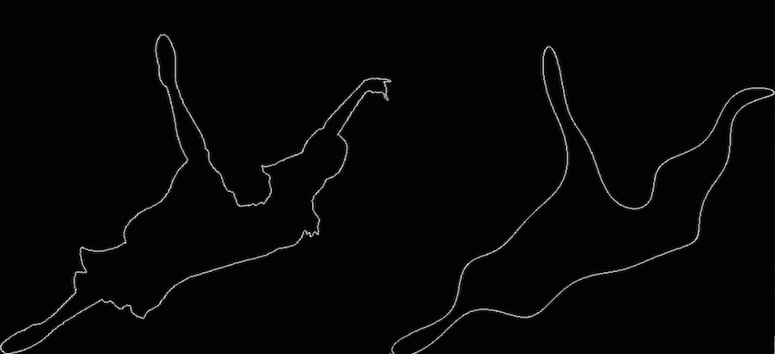

# Problem Statement

The objective of this problem is to evaluate how invariant the descriptors calculated are to simple geometric transformations: rotation, translation and change of scale.

To do this, you must do the following: 
- Make a program that loads an image from a file, threshold it and draw outlines.

- Once the coordinates defining the contours have been extracted, a geometric transformation will be applied to them.

- Both the coordinates of the original contours and the coordinates of the transformed contours must calculate the moments of Hu and their Fourier descriptors (for the latter case, consider only the 15 lowest coefficients of the representation).

- Once you have the original descriptors and the transformed ones, you have to describe how they vary in terms of the transformation parameters. 

- The parameters to be considered are a rotation angle, translation and a scale change. For this, all combinations with  θ ∈ {0,60,90,180,225} should be considered. 

- The horizontal and vertical translations should be random numbers in the range [-10,100] [- 10,100]

- The Changes in scale should be some of the following: s ∈ {0.5,1,1,5,3}.

# Images

One of the images to conduct the tests looks like this: 

# Methodology

Unfortunately, the report I've written (which has a more deglossed description of the results) is in Spanish. However we can present the output of the program. What the program basically does is:

- Takes an image
- Thresholds it
- Outputs the thresholded image
- Applies transformation to image
- Obtains the contour of the image and the transformed one
- Calculates Hu moments of the original image and the transformed one
- Calculates Fourier Descriptors of the original image and the transformed one
- Outputs transformed image
- Outputs the reconstructed image out of its Fourier coefficients

# Results and Output

In short, we find that the Hu moments are invariant to all the transforms listed in the Problem Statement. On the other hand, the "Fourier Descriptors" are not invariant. This is because our "Fourier Descriptor" implementation takes into account both the magnitude and phase angle of the Fourier coefficient. Also, we do not divide by a chosen Fourier coefficient in order to remove the common factor caused by the scaling.

A screenshot of the program in action looks like this. To the left, we observe the contour of the transformed image. To the right, the Fourier representation (n=15) of the image.

