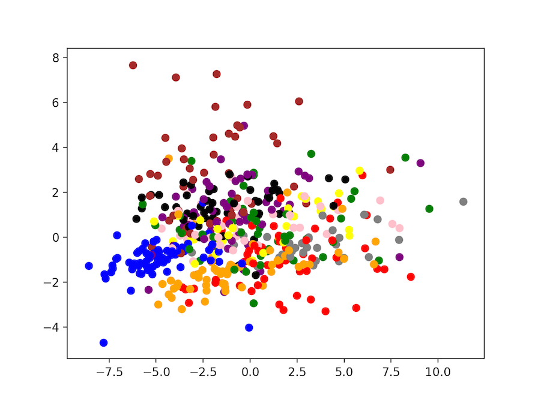

# Problem Statement
The problem is training the MNIST dataset with a simple MLP (Multilayer Perceptron). For those
who don't know what MNIST dataset is, it is a dataset that contains the binarized images
of single digits in handwriting. The task is to predict the digit given an image of the digit.

# (Brief) Methodology
## Description
We have implemented the MLP in the file `nn.py`. It is currently being trained by the Conjugate Gradient method
which is an iterative method that does a sufficiently good enough job in training the MLP, taking decently sized
steps in the direction of the minima. Since this is a pet project for the school we have not utilized validation
methods. Instead we just train the network with the whole of the MNIST database as a whole batch and verify the accuracy against
a few samples.
If our implementation is correct, we should expect an accuracy of near 100%. (Spoilers: we get 95-99%). There are three files
which you should look at:
- `nn.py`: The implementation of the MLP.
- `img.py`: The training of the MLP with the serialized image as input.
- `mom.py`: The training of MLP with the [image moments](https://en.wikipedia.org/wiki/Image_moment) as input. This file also uses
[PCA](https://en.wikipedia.org/wiki/Principal_component_analysis) to visualize the data in 2-D.

## Preprocessing (At least?)
We have standarized the database using the [`scale()`](http://scikit-learn.org/stable/modules/generated/sklearn.preprocessing.scale.html) function from the package [sklearn](http://scikit-learn.org/stable/). It also calculates the image moments in the file `mom.py`.

# Results and Output
## `img.py`
The process of the file `img.py` will consist of the program loading the whole of database in memory (I hope you have enough RAM) and
displaying the cost of the network at each epoch. It will plot and display a graph of the cost at the end along with images of the missclasifications. The plot of the function should be convex since we trained the network with the whole database as a batch. Finally, it should also output `n` predictions with the last line being the accuracy:

```python
Predict X[ index ]: predicted_class
Real value y[ index ]: actual_class
.
.
.
Accuracy 98.0 %
```
## `mom.py`
The `mom.py` file is a little bit more interesting. It does exactly the same things as `img.py` but instead of training the network
with the serialized image, it trains it with the 24 image moments. So instead of a dataset with 28x28=784 features, we only have 24! Woo hoo! Begone, curse of dimensionality! Sort of. Finally, this script will also plot a graph of what the data looks like after utilizing PCA to reduce its dimensionality to 2-D. Below we can appreciate the images. The points are colored according to their label. 

## Cost of the network

## Missclassification

## PCA

# Requirements
- [numpy](http://www.numpy.org/)
- [opencv](http://opencv.org/)
- [sklearn](http://scikit-learn.org/stable/)
- [pandas](http://pandas.pydata.org/)
- [matplotlib](https://matplotlib.org/)
